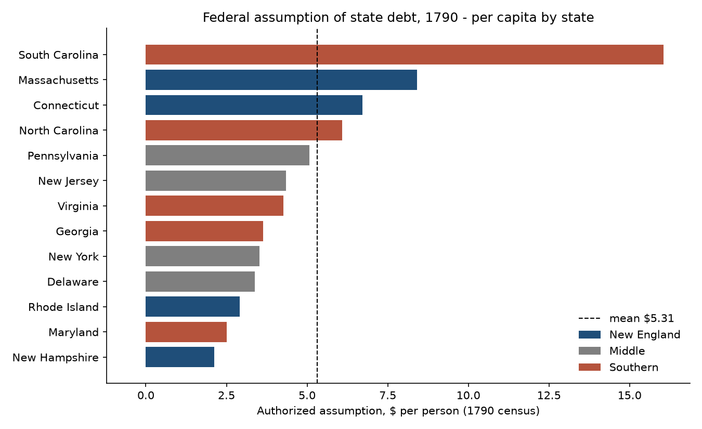
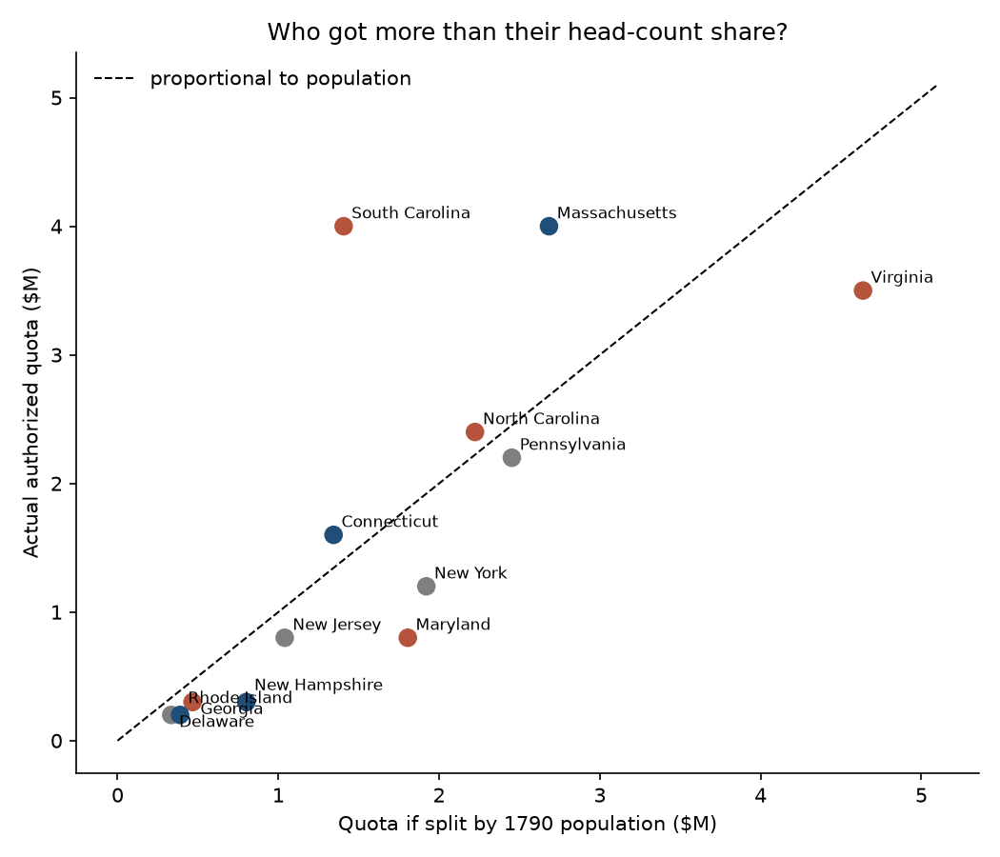

# Was Hamilton's 1790 Debt Assumption Fair?

A statistical analysis of the first big allocation decision in U.S. federal finance:
how the Funding Act of 1790 split $21.5 million of assumed state war debt across the
13 states, and whether that split tracked any defensible basis.

> **Status:** v1 complete - data compiled from primary sources, descriptive stats,
> regional hypothesis tests, and allocation-gap analysis. See `output/summary.md`.

## The question

In January 1790, Treasury Secretary Alexander Hamilton proposed that the federal
government "assume" the states' unpaid Revolutionary War debts. Congress passed a
modified version in August. Section 14 of the Act fixed a dollar ceiling per state.
Madison and the Virginians objected that states which had already taxed themselves
to pay down debt were being made to subsidize states that hadn't.

This project asks the accountant's version of that fight: **if you had to defend the
allocation to an auditor, could you?**

## Headline findings

| | |
|---|---|
| Per-capita assumption, mean / median | $5.31 / $4.26 |
| Coefficient of variation | 0.70 (very unequal) |
| Only statistical outlier | **South Carolina: $16.06 per person**, 3x the mean, z = +2.9 |
| Share of the $21.5M that would have to move to make it population-proportional | **~20%** ($4.3M), under any of three population bases |
| New England vs. Southern per-capita gap | -$1.47, not distinguishable from random labeling (exact permutation p = 0.78) |

1. **The split was not proportional to population, and it isn't close.** A chi-square
   goodness-of-fit against a per-head split rejects at p < 1e-10, and roughly one
   dollar in five would have to change hands to fix it. That holds whether you count
   total population, free population, or the Constitution's three-fifths basis.
2. **The "North vs. South" story is wrong.** The regional means differ, but South
   Carolina alone drives the Southern average. Strip it out and the South is *under*-
   allocated. The real axis is "states that still owed a lot" vs. "states that didn't."
3. **Virginia's grievance depends on which population you count.** Against total
   population Virginia was short $1.1M; against *free* population it was short only
   $60K. Madison's complaint looks strong or weak depending on whether enslaved
   people are in the denominator - the same three-fifths question that shaped the
   Constitution three years earlier.
4. **Two states, one dollar in three.** Massachusetts and South Carolina together got
   37% of the total with 19% of the population. Both had run up the largest unpaid
   war debts; the Act followed the debt, not the head count - which is exactly what
   Hamilton intended. Fair by *"pay what is owed"*, unfair by *"share the burden equally."*




## Notes

- **Population, not sample.** The 13 states are the whole universe. The permutation
  test asks "how often would shuffling the region labels produce a gap this large?" -
  a legitimate question - but with 4 vs. 5 observations it has almost no power. I
  report effect sizes first and p-values second.
- **Three tests, same answer.** Welch t, Mann-Whitney, and an exact permutation test
  all agree (no regional effect). Reporting all three is cheap insurance against
  someone asking "but did you check normality?"
- **Dissimilarity index.** "Share that would have to move" is half the sum of absolute
  gaps as a percent of the total - the same construct used for budget-vs-benchmark
  variance and segregation indices. It's more interpretable than a chi-square statistic.
- **The denominator is a choice.** Per-capita by total vs. free population reorders
  the states. I show both and say which one I'd defend.

## Data

| File | What | Source |
|---|---|---|
| `data/assumption_1790.csv` | Authorized assumption per state; 1790 population, total and enslaved | Funding Act of 1790, 1 Stat. 138, sec. 14; First Census, 1790 |
| `data/SOURCES.md` | Citations and boundary decisions (Maine in MA, Kentucky in VA) | |

Caveat: the Act's figures are *ceilings*. Only ~$18.3M was actually subscribed.
Per-state subscription totals exist in Treasury reports and are the obvious v2.

## Run it

```bash
python -m venv .venv
.venv\Scripts\activate
pip install -r requirements.txt
python src/analysis.py
```

Outputs land in `output/`: `summary.md`, `assumption_by_state.csv`, three PNG charts.

## Next steps

- [ ] Add actual per-state subscriptions (Treasury report, 1792/1795) and compare
      quota vs. take-up - which states left money on the table?
- [ ] Add a "debt already retired by the state before 1790" column to test Madison's
      claim directly (Ferguson, *The Power of the Purse*, has the numbers)
- [ ] Sensitivity: rerun with Maine and Kentucky excluded
