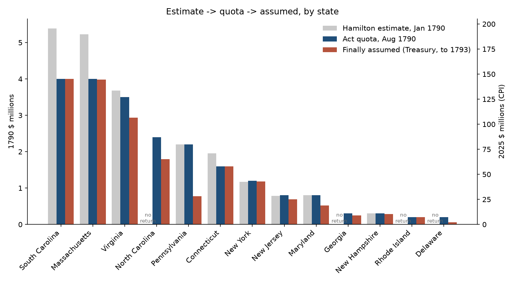
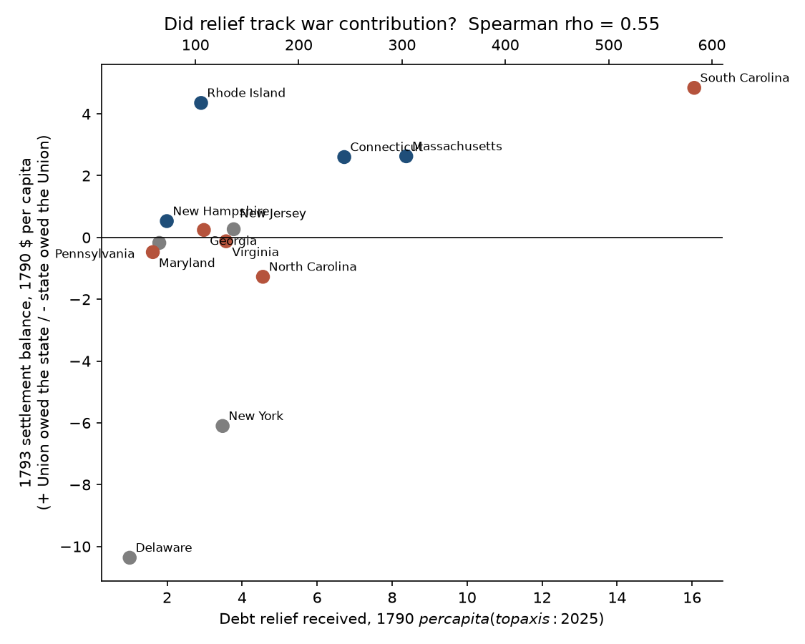
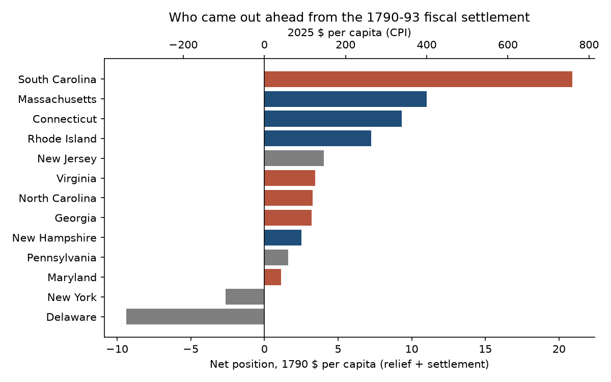

# Was Hamilton's 1790 Debt Assumption Fair?

An accountant's reconciliation of the first big allocation decision in U.S. federal
finance: the Funding Act of 1790 let the federal government absorb up to $21.5 million
of the states' Revolutionary War debt. This project follows that number through every
Treasury document that touched it - estimate, statute, subscription, final assumption,
and the 1793 settlement of war accounts - and asks whether the split was defensible.

> **Status:** Analysis complete (v2). Five primary-source ledgers compiled, footed, and
> reconciled; statistical tests run; opinion written. Next: Power BI dashboard.
> Full results in [`output/summary.md`](output/summary.md).

## Dollars

All amounts are shown as **1790 $ (2025 $)**. Conversion is by CPI at 36.3x
(MeasuringWorth; the Federal Reserve's series starts in 1800 and gives ~19x from that
year). CPI understates the scale: the $21.5M authorized was about **11% of 1790 GDP**.
The same share of today's economy is roughly **$3.4 trillion**.

## The question

Hamilton's *First Report on Public Credit* (January 1790) proposed that the federal
government assume the states' unpaid war debts. Madison and Virginia objected: states
that had already taxed themselves to pay down debt would now fund relief for states
that hadn't. The bill deadlocked, then passed via the Compromise of 1790 (capital on
the Potomac, Virginia's quota raised).

This is the accountant's version of that fight: **if you had to defend the allocation
to an auditor, could you?**

## The ledgers

| Step | Document | Date | What it gives |
|---|---|---|---|
| Opening balance | Schedule E, Report on Public Credit | 9 Jan 1790 | State debt as reported by 6 states, estimated by Hamilton for 3, blank for 4 |
| Authorization | Funding Act, sec. 14 (1 Stat. 138) | 4 Aug 1790 | Quota per state, $21.5M total |
| Interim take-up | Enclosure D, Report on Public Debt and Loans | 25 Jan 1792 | Subscribed vs. quota, first window |
| Final assumption | Bayley, *History of the National Loans* (Treasury) | 1881 | Final amount assumed per state, $18.27M |
| True-up | Commissioners for Settling Accounts to Washington | 29 Jun 1793 | Creditor / debtor balance per state |
| Allocation base | First Census | 1790 | Total and enslaved population |

All from Founders Online (National Archives) or the Treasury itself. Citations,
boundary decisions, and OCR reconciliation in [`data/SOURCES.md`](data/SOURCES.md).

## Headline findings

**The source documents don't all foot.** Hamilton's 1792 subscription table states a
total of $18,328,186 but its rows sum to $17,798,186. Row-level tie-out (quota minus
subscribed must equal unsubscribed) isolates a $500,000 transcription error in the North
Carolina line. Found before any analysis was run; reconciled figure used throughout.

**The quotas were set on a balance sheet that was one-third estimate and one-third
blank.** Six states sent returns. Hamilton estimated three by round number. Four (RI, DE,
NC, GA) had nothing on file and were assigned $3.1M between them anyway - North
Carolina's $2.4M is the largest figure in the Act with no return behind it.

**Congress cut the two biggest claimants by a quarter.** Massachusetts and South
Carolina reported $5.2M and $5.4M; the Act capped both at $4.0M. Both then
over-subscribed their quota, confirming the reported debt was real.

**Utilization was 85%.** $18.27M of $21.5M was assumed. Pennsylvania used 35% of its
quota, Delaware 30%. The Act absorbed about two-thirds of state debt, not all of it -
Hamilton's own estimate left $8.3M still on state books.

**Virginia was a debtor state.** The 1793 commissioners found Virginia owed the Union
$100,879. Madison's argument - that Virginia had over-paid for the war - was contradicted
by the audit he had demanded. The Compromise of 1790 was a political price, not an
accounting correction.

**Relief tracked contribution.** Creditor states (the seven the commissioners found were
owed money) received $6.12 per head of debt relief; debtor states received $2.67
(exact permutation p = 0.047; Spearman rho = 0.55). The Act didn't have the settlement
numbers, but it landed on the right side of them.

**Not proportional to population, and not meant to be.** About 20% of the $21.5M would
have to move between states to match any population basis (total, free, or
three-fifths). The "New England vs. South" story doesn't hold: exact permutation
p = 0.78. South Carolina alone ($16.06 per head, 3x the mean, the only outlier) drives
the Southern average.

**Net position, 1790-93.** Adding relief received to the settlement balance, eleven of
thirteen states came out ahead. South Carolina gained $20.90 per head ($759 today),
Massachusetts $11.00. New York (-$2.62) and Delaware (-$9.36) lost - both were
under-allocated in the Act *and* debtors in the settlement.





## Opinion

**On the method:** not defensible as an apportionment. Incomplete returns, arbitrary
caps on the largest claimants, round numbers for states with no data.

**On the outcome:** defensible, and better than the method deserved. The states that got
the most relief were the states that had the most debt *and* the states the 1793 audit
found had over-contributed to the war. Rough justice, reconciled within three years.

**On Madison:** wrong on the facts for his own state.

**On Hamilton's "bind the creditors to the Union" rationale:** untestable at the state
level - it's about who held the paper, which needs subscriber-level records.

## Notes

- **Foot first.** Every table was tied to its own printed totals before analysis. One
  didn't tie. That finding is in the write-up, not hidden.
- **Population, not sample.** Thirteen states are the whole universe. Permutation tests
  answer "how often would random labeling produce this gap?" - a legitimate question -
  but with n = 4 to 7 per group they have little power. Effect sizes are reported first.
- **Three tests, same answer.** Welch t, Mann-Whitney, and exact permutation agree on
  every comparison. Cheap insurance against "did you check normality?"
- **Dissimilarity index.** "Share that would have to move" is half the sum of absolute
  gaps as a percent of the total - the same construct as budget-vs-benchmark variance.
- **The denominator is a choice.** Per capita by total vs. free population reorders the
  states. Both are shown; neither changes a conclusion.
- **Two dollar figures, always.** 1790 $ with 2025 $ beside it. CPI for purchasing power;
  GDP share for scale.

## Run it

```bash
python -m venv .venv
.venv\Scripts\activate
pip install -r requirements.txt
python src/analysis.py
```

Outputs land in `output/`: `summary.md` (full write-up), `assumption_ledger.csv`
(one row per state, every column, with 2025-dollar twins - the Power BI source), and
five charts.

## Next steps

- [ ] Power BI dashboard on `assumption_ledger.csv`
- [ ] Interest-rate haircut: assumed debt was funded at 4/9 at 6%, 2/9 deferred ten years,
      3/9 at 3%. Present-value the relief to see what states *really* received.
- [ ] Subscriber-level records (loan-office ledgers, RG 53) to test the "creditors bound
      to the Union" claim directly
