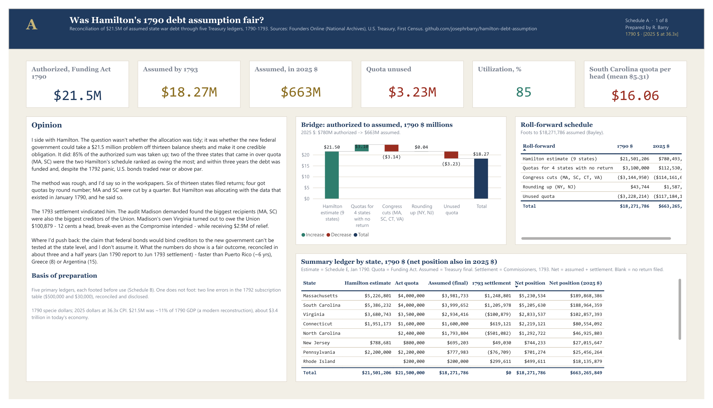
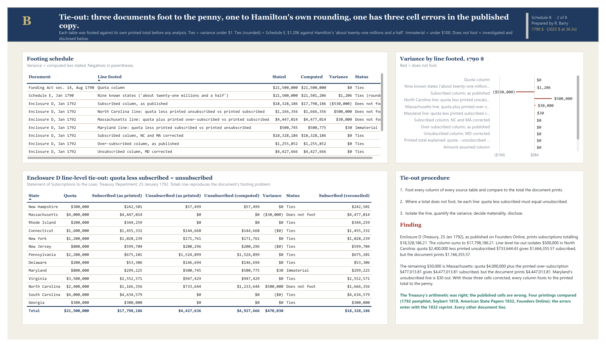
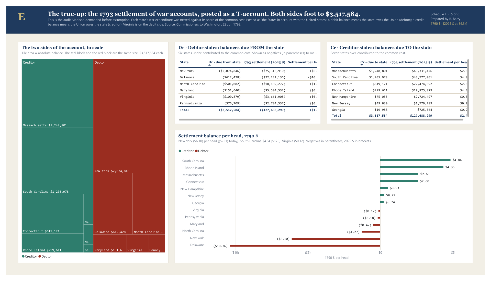
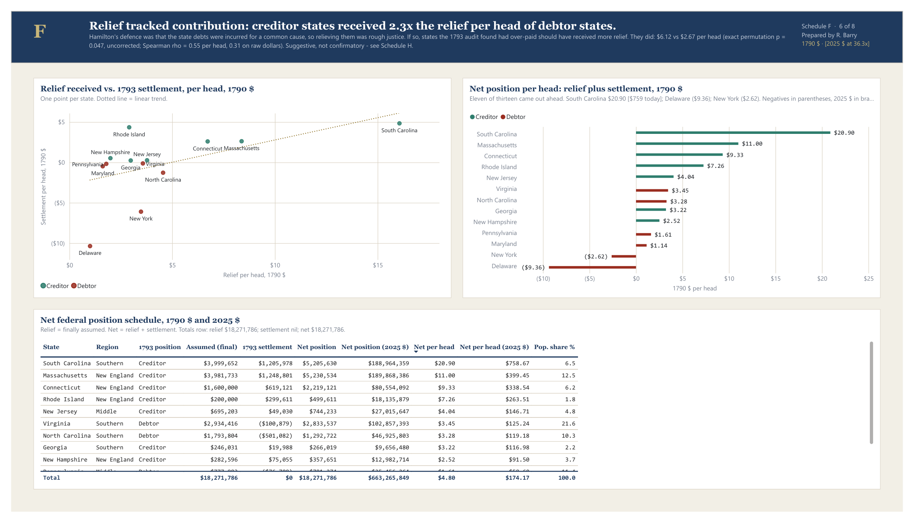

# Was Hamilton's 1790 Debt Assumption Fair?

An accountant's reconciliation of the first big allocation decision in U.S. federal
finance: the Funding Act of 1790 let the federal government absorb up to $21.5 million
of the states' Revolutionary War debt. This project follows that number through every
Treasury document that touched it - estimate, statute, subscription, final assumption,
and the 1793 settlement of war accounts - and asks whether the split was defensible.

> **Status:** Complete. Five primary-source ledgers compiled, footed and reconciled;
> statistical tests run; opinion written; eight-schedule Power BI report built from code.
> Full results in [`output/summary.md`](output/summary.md).
> **View the report:** [Power BI report as PDF](powerbi/hamilton_debt_assumption.pdf) (8 schedules) ·
> [screenshots](docs/screenshots/)

## Dollars

All amounts are shown as **1790 $ [2025 $ in brackets]**. Conversion is by CPI at 36.3x
(MeasuringWorth; the Federal Reserve's series starts in 1800 and gives ~19x from that
year). CPI understates the scale: the $21.5M authorized was about **11% of 1790 GDP**
(a modern reconstruction - no national accounts existed - so an order of magnitude).
The same share of today's economy is roughly **$3.4 trillion**. Negatives are shown in
parentheses throughout.

## The question

Hamilton's *First Report on Public Credit* (January 1790) proposed that the federal
government assume the states' unpaid war debts. Madison and Virginia objected: states
that had already taxed themselves to pay down debt would now fund relief for states
that hadn't. The bill deadlocked, then passed via the Compromise of 1790: the capital
went to the Potomac, and Virginia's quota was set at $3.5M - about what Virginia would
pay in federal taxes, so it would "neither gain nor lose." That was below Hamilton's own
$3.68M estimate of Virginia's debt.

This is the accountant's version of that fight: **if you had to defend the allocation
to an auditor, could you?**

## The ledgers

| Step | Document | Date | What it gives |
|---|---|---|---|
| Opening balance | Schedule E, Report on Public Credit | 9 Jan 1790 | State debt as reported by 6 states, estimated by Hamilton for 3, blank for 4 |
| Authorization | Funding Act, sec. 14 (1 Stat. 138) | 4 Aug 1790 | Quota per state, $21.5M total |
| Interim take-up | Enclosure D, Report on Public Debt and Loans | 25 Jan 1792 | Subscribed vs. quota, first window |
| Final assumption | Bayley, *History of the National Loans* (Treasury) | 1881 | Final amount assumed per state, $18.27M |
| True-up | Commissioners for Settling Accounts to Washington | 29 Jun 1793 | Creditor / debtor balance per state |
| Allocation base | First Census | 1790 | Total and enslaved population |

All from Founders Online (National Archives) or the Treasury itself. Citations,
boundary decisions, and OCR reconciliation in [`data/SOURCES.md`](data/SOURCES.md).

**How it was built.** There was no dataset. Each table was transcribed from the
document into a small CSV, then footed against the total the document prints. I
built the project with Claude Code as an assistant for transcription, scripting and
review; the verification method - footing, line-level tie-out, documented sources,
and an independent review pass whose corrections are in the commit history - is what
makes the figures trustworthy, and every step of it can be retraced from the repo.

## Headline findings

**The source documents don't all foot.** Hamilton's 1792 subscription table states a
total of $18,328,186 but its rows sum to $17,798,186. Row-level tie-out (quota minus
subscribed must equal unsubscribed) isolates a $500,000 error in the North Carolina line
and a $30,000 error in the Massachusetts over-subscription line - and the second one was
carried into the printed total, which explains the whole gap. Reconciled total:
$18,298,186. Found before any analysis was run; reconciled figures used throughout.

**The quotas were set on a balance sheet that was one-third estimate and one-third
blank.** Six states sent returns. Hamilton estimated three by round number. Four (RI, DE,
NC, GA) had nothing on file and were assigned $3.1M between them anyway - North
Carolina's $2.4M is the largest figure in the Act with no return behind it.

**Congress cut the two biggest claimants by a quarter.** Massachusetts and South
Carolina reported $5.2M and $5.4M; the Act capped both at $4.0M. Both then subscribed
more than their quota in the first window, confirming the reported debt was real - but
the quota was a ceiling, so neither received more than $4.0M (final: SC $3,999,652,
MA $3,981,733).

**Utilization was 85%.** $18.27M of $21.5M was assumed. Pennsylvania used 35% of its
quota, Delaware 30%. By Hamilton's own estimate, which left $8.3M still on state
books, the Act absorbed about 70% of state debt, not all of it - though that residual
is his estimate, graded a-f for reliability, not an audited figure.

**Virginia was a debtor state.** The 1793 commissioners found Virginia owed the Union
$100,879. Madison's argument - that Virginia had over-paid for the war - was contradicted
by the audit he had demanded. The Compromise of 1790 was a political price, not an
accounting correction.

**Relief tracked contribution.** Creditor states (the seven the commissioners found were
owed money) received $6.12 per head of debt relief; debtor states received $2.67
(exact permutation p = 0.047, uncorrected for multiple comparisons; Spearman rho = 0.55
per head, 0.31 on raw dollars, since per-capita ratios share a denominator). Suggestive,
not confirmatory - with 13 states the 2.3x effect size is the reliable statement. The Act
didn't have the settlement numbers, but it landed on the right side of them.

**Not proportional to population, and not meant to be.** About 20% of the $21.5M would
have to move between states to match any population basis (total, free, or
three-fifths). No detectable "New England vs. South" tilt: exact permutation p = 0.78,
though with 4 vs. 5 states the test has little power. South Carolina alone ($16.06 per
head, 3x the mean, the only outlier) drives the Southern average.

**Net position, 1790-93.** Adding relief received to the settlement balance, eleven of
thirteen states came out ahead. South Carolina gained $20.90 per head [$759 today],
Massachusetts $11.00. New York ($2.62) and Delaware ($9.36) lost - both were
under-allocated in the Act *and* debtors in the settlement.


## Opinion

**I side with Hamilton.** The question wasn't whether the allocation was tidy; it was
whether the new federal government could take a $21.5 million problem off thirteen
balance sheets and make it one credible obligation. It did. 85% of the authorized sum
was taken up, two of the three states that brought in more than their quota were
exactly the two Hamilton's own schedule ranked as owing the most (the third, Rhode
Island, wasn't in his schedule at all), and within three years the country had a
funded national debt and, despite a sharp market panic in 1792, credit good enough
that its bonds traded near or above par.

**The method was rough, and I'd say so in the workpapers.** Six of thirteen states filed
returns. Four got quotas by round number. Massachusetts and South Carolina were cut by a
quarter. If I were auditing the allocation itself, I'd write it up. But Hamilton wasn't
allocating with good data; he was allocating with the data that existed in January 1790,
and he said so in the report.

**The 1793 settlement vindicated him.** The audit Madison demanded found that the biggest
recipients, Massachusetts and South Carolina, were also the biggest creditors of the Union.
Relief tracked contribution. Madison's own Virginia, which he said had already paid its
share, turned out to owe the Union $100,879 - about 12 cents a head, which is to say it
broke even, exactly as the Compromise of 1790 intended, while receiving $2.9 million of
relief. His objection had no grievance the numbers supported.

**Where I'd push back on Hamilton:** the argument that federal bonds would bind wealthy
creditors to the new government can't be tested with state-level data, and I don't assume
it. What I can defend is narrower and, I think, more useful: the outcome was fair on the
numbers, and it was reconciled in about three and a half years - January 1790 report to
June 1793 settlement - which compares well with Puerto Rico (2016-22, about six years),
Greece (2010-18, eight) or Argentina (2001-16, fifteen).

## The Power BI report

Eight schedules, laid out like an audit file rather than a dashboard: lettered pages,
a tie-out schedule, a roll-forward, a T-account, totals on every table, negatives in
parentheses, and both dollar bases side by side.

| Schedule | Content | Form |
|---|---|---|
| A · Summary & opinion | Opinion, KPI cards, bridge, roll-forward, summary ledger | waterfall + tables |
| B · Tie-out | Footing schedule (stated vs. computed vs. variance), Enclosure D line-level tie-out | tables + variance bars |
| C · Ledger | State x document matrix, variance schedule | matrix |
| D · Take-up | Quota used vs. unused, utilization gauge, take-up schedule | stacked bars + gauge |
| E · 1793 T-account | Creditors (Dr) and debtors (Cr), both footing to $3,517,584; sides to scale | T-account + treemap |
| F · Fairness test | Relief vs. settlement scatter, net position | scatter |
| G · Apportionment | Quota minus per-head share, population-basis slicer | diverging bars |
| H · Statistics & sources | Test schedule, notes, sources | table |

**Schedule A - Summary & opinion.** Six KPIs, the opinion, the bridge from $21.5M
authorized to $18.27M assumed, a roll-forward that foots, and the summary ledger.



**Schedule B - Tie-out.** Every source document footed to its printed total. The 1792
subscription table has two line errors; correcting them closes the Treasury's own gap
to zero.



**Schedule E - The 1793 T-account.** Debtor states on the debit side, creditor states
on the credit side, both footing to $3,517,584, with the two sides drawn to scale.



**Schedule F - The fairness test.** Relief per head against the 1793 settlement per
head, and each state's net position.



All eight schedules are in the [PDF](powerbi/hamilton_debt_assumption.pdf) and in
[`docs/screenshots/`](docs/screenshots/).

The report is a Power BI project (`powerbi/hamilton_debt_assumption.pbip`). The
semantic model (tables, DAX measures, relationships) and every page and visual are
generated by `src/build_model.py` and `src/build_pbir.py`, so the whole thing is
version-controlled and rebuildable.

## Run it

```bash
python -m venv .venv
.venv\Scripts\activate
pip install -r requirements.txt
python src/analysis.py                 # foots the sources, runs the tests -> output/
python src/build_dashboard_data.py     # tidy tables for the report -> powerbi/data/
python src/build_model.py              # semantic model (TMDL) + project scaffolding
python src/build_pbir.py               # report pages and visuals (PBIR)
```

Then open `powerbi/hamilton_debt_assumption.pbip` in Power BI Desktop and click
Refresh. Close Desktop before re-running the build scripts (they clear its cache).

`output/` holds `summary.md` (the full write-up), `assumption_ledger.csv` (one row per
state, every column, with 2025-dollar twins) and five charts.

## Possible extensions

- [ ] Interest-rate haircut: assumed debt was funded at 4/9 at 6%, 2/9 deferred ten years,
      3/9 at 3%. Present-value the relief to see what states *really* received.
- [ ] Subscriber-level records (loan-office ledgers, RG 53) to test the "creditors bound
      to the Union" claim directly
